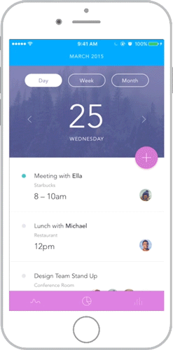

[](http://cocoapods.org/pods/SwipeableTabBarController)


[](http://cocoapods.org/pods/SwipeableTabBarController)
[](https://codebeat.co/projects/github-com-marcosgriselli-swipeabletabbarcontroller-master)

## 🌟 Features

- [x] Zero setup 
- [x] Different animations
- [x] Enable/Disable interactions easily
- [x] Fluid gestures

## 📲 Installation

#### Using [CocoaPods](https://cocoapods.org)

Edit your `Podfile` and specify the dependency:

```ruby
pod 'SwipeableTabBarController'
```

#### Using [Carthage](https://github.com/carthage)

Edit your `Cartfile` and specify the dependency:

```bash
github "marcosgriselli/SwipeableTabBarController"
```

#### Manual

Drop the classes inside of SwipeableTabBarController/Classes into your project.

## 👩‍💻 How to use

### Setup

If you don't need subclassing `UITabBarController` just set the `UITabBarController` on the Storyboard to be of type `SwipeableTabBarController`.

Otherwise, make a subclass of `SwipeableTabBarController`.

```swift
import SwipeableTabBarController

class TabBarController: SwipeableTabBarController {
    // Do all your subclassing as a regular UITabBarController.
}
```

### Animations

`SwipeableTabBarController` supports 3 different types of animations out of the box. Setting the desired animation is easy. On your `SwipeableTabBarController` subclass just do:

```swift
swipeAnimatedTransitioning?.animationType = SwipeAnimationType.sideBySide
```

If you are supporting just one type of animation call it on `viewDidLoad()` otherwise call it as you need to change the desired animation.

#### Side by Side (default)

<a href="url"></a>

The default animation is `SwipeAnimationType.sideBySide` where the newly selected tab will move in at the same speed the previous one moves out.

#### Overlap

<a href="url"></a>

`SwipeAnimationType.overlap` the newly selected tab will move in to take the central place on top of the previous one which will hold it's position.

#### Push

<a href="url"></a>

`SwipeAnimationType.push` follows iOS default push animation where the top view moves away while the bottom one slightly moves behind. In this case, the top view will be the previously selected tab view.

<!-- 
### Restricted Swipe

You can choose to restrict your swiping to perfect horizontal swipe or support diagonal movement as well. I recommend enabling horizontal swipe if you are not using any kind of scrollViews on your controllers.

Default value is ```false```

```swift
setDiagonalSwipe(enabled: true)
```
--->

### Enable Cycling 

`SwipeableTabBarController` supports cycling between the first and last tab like a carousel. Simply set `isCyclingEnabled` to `true`.

Default value is `false`
```swift
isCyclingEnabled = true
```

### Minimum/Maximum number of touches 

You can set both the minimum and the maximum number of touches needed to handle the swipe gesture. Simply set `minimumNumberOfTouches` or `maximumNumberOfTouches`  property.

Default value is `1`
```swift
minimumNumberOfTouches = 2
```

Default value is `Int.max`
```swift
maximumNumberOfTouches = 2
```

### Disable Interaction

Support for disabling/enabling the interactor, this can be used on a controller that uses horizontal scrollView or a Map (in the example).

Default value is ```true```

```swift
isSwipeEnabled = false
```

## ❤️ Contributing
This is an open source project, so feel free to contribute. How?
- Open an [issue](https://github.com/marcosgriselli/Sizes/issues/new).
- Send feedback via [twitter](https://twitter.com/marcosgriselli).
- Propose your own fixes, suggestions and open a pull request with the changes.

**Contributors**

[](https://sourcerer.io/fame/marcosgriselli/marcosgriselli/SwipeableTabBarController/links/0)[](https://sourcerer.io/fame/marcosgriselli/marcosgriselli/SwipeableTabBarController/links/1)[](https://sourcerer.io/fame/marcosgriselli/marcosgriselli/SwipeableTabBarController/links/2)[](https://sourcerer.io/fame/marcosgriselli/marcosgriselli/SwipeableTabBarController/links/3)[](https://sourcerer.io/fame/marcosgriselli/marcosgriselli/SwipeableTabBarController/links/4)[](https://sourcerer.io/fame/marcosgriselli/marcosgriselli/SwipeableTabBarController/links/5)[](https://sourcerer.io/fame/marcosgriselli/marcosgriselli/SwipeableTabBarController/links/6)[](https://sourcerer.io/fame/marcosgriselli/marcosgriselli/SwipeableTabBarController/links/7)

## 👨‍💻 Author

Marcos Griselli | <a href="url"></a> [@marcosgriselli](https://twitter.com/marcosgriselli)

[](https://twitter.com/marcosgriselli)

[](https://github.com/marcosgriselli)

## 🛡 License

```
MIT License

Copyright (c) 2018 Marcos Griselli

Permission is hereby granted, free of charge, to any person obtaining a copy
of this software and associated documentation files (the "Software"), to deal
in the Software without restriction, including without limitation the rights
to use, copy, modify, merge, publish, distribute, sublicense, and/or sell
copies of the Software, and to permit persons to whom the Software is
furnished to do so, subject to the following conditions:

The above copyright notice and this permission notice shall be included in all
copies or substantial portions of the Software.

THE SOFTWARE IS PROVIDED "AS IS", WITHOUT WARRANTY OF ANY KIND, EXPRESS OR
IMPLIED, INCLUDING BUT NOT LIMITED TO THE WARRANTIES OF MERCHANTABILITY,
FITNESS FOR A PARTICULAR PURPOSE AND NONINFRINGEMENT. IN NO EVENT SHALL THE
AUTHORS OR COPYRIGHT HOLDERS BE LIABLE FOR ANY CLAIM, DAMAGES OR OTHER
LIABILITY, WHETHER IN AN ACTION OF CONTRACT, TORT OR OTHERWISE, ARISING FROM,
OUT OF OR IN CONNECTION WITH THE SOFTWARE OR THE USE OR OTHER DEALINGS IN THE
SOFTWARE.
```
