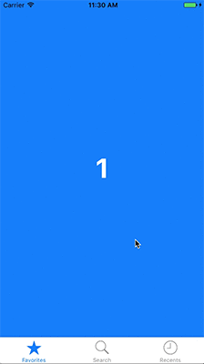

# SwipeableTabBarController

[](http://cocoapods.org/pods/SwipeableTabBarController)
[](http://cocoapods.org/pods/SwipeableTabBarController)


<a href="url"></a><br />

## Usage 

If you don't need subclassing `UITabBarController` just set the `UITabBarController` on the Storyboard to be of type `SwipeableTabBarController`.

Otherwise make a sublcass of `SwipeableTabBarController`. 

Example:

```swift
import SwipeableTabBarController

class TabBarController: SwipeableTabBarController {
    // Do all your subclassing as a regular UITabBarController.
}
```

## Example

To run the example project, clone the repo, and run `pod install` from the Example directory first.

## Installation

SwipeableTabBarController is available through [CocoaPods](http://cocoapods.org). To install
it, simply add the following line to your Podfile:

```ruby
pod "SwipeableTabBarController"
```

## Author

[@marcosgriselli](https://twitter.com/marcosgriselli) 

## License

SwipeableTabBarController is available under the MIT license. See the LICENSE file for more info.
