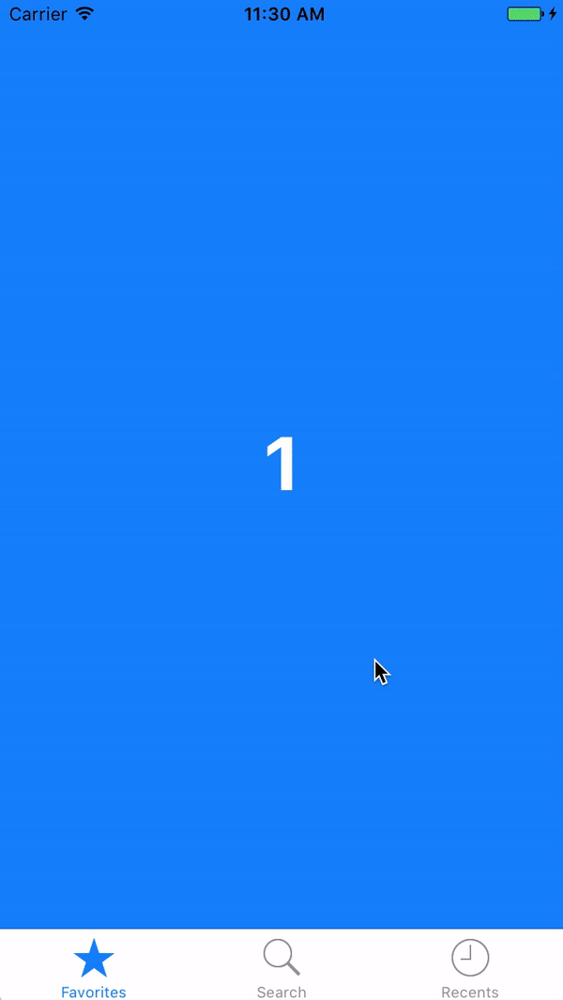
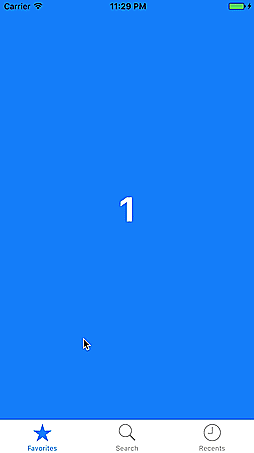
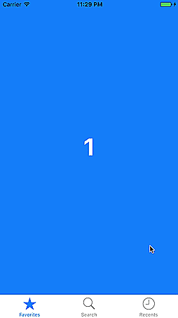
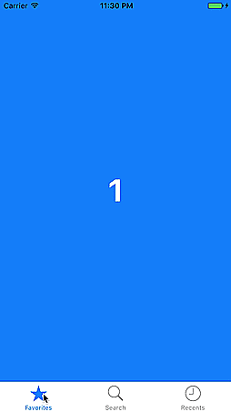

[](http://cocoapods.org/pods/SwipeableTabBarController)
[](http://cocoapods.org/pods/SwipeableTabBarController)


[](https://codebeat.co/projects/github-com-marcosgriselli-swipeabletabbarcontroller-master)

<a href="url"></a><br />


The iPhone mockups can be found [here](https://pixabay.com/en/phone-iphone-black-cellphone-1830479/) &  [here](https://pixabay.com/en/iphone-iphone-6s-smartphone-mobile-1936818/).

All the designs belong to [To Do App UI kit](https://www.invisionapp.com/do) by [Invision](https://www.invisionapp.com).

## Installation

### CocoaPods

SwipeableTabBarController is available through [CocoaPods](http://cocoapods.org). To install
it, simply add the following line to your Podfile:

```ruby
pod "SwipeableTabBarController"
```

### Manual

Drop the classes inside of SwipeableTabBarController/Classes into your project.

## Usage

If you don't need subclassing `UITabBarController` just set the `UITabBarController` on the Storyboard to be of type `SwipeableTabBarController`.

Otherwise, make a subclass of `SwipeableTabBarController`.

Example:

```swift
import SwipeableTabBarController

class TabBarController: SwipeableTabBarController {
    // Do all your subclassing as a regular UITabBarController.
}
```

### Animations

`SwipeableTabBarController` supports 3 different types of animations out of the box. Setting the desired animation is easy. On your `SwipeableTabBarController` subclass just do:

```swift
setSwipeAnimation(type: SwipeAnimationType.push)
```

If you are supporting just one type of animation call it on `viewDidLoad()` otherwise call it as you need to change the desired animation.

#### Side by Side (default)

<a href="url"></a>

The default animation is `SwipeAnimationType.sideBySide` where the newly selected tab will move in at the same speed the previous one moves out.

#### Overlap

<a href="url"></a>

`SwipeAnimationType.overlap` the newly selected tab will move in to take the central place on top of the previous one which will hold it's position.

#### Push

<a href="url"></a>

`SwipeAnimationType.push` follows iOS default push animation where the top view moves away while the bottom one slightly moves behind. In this case, the top view will be the previously selected tab view.

### Restricted Swipe

You can choose to restrict your swiping to perfect horizontal swipe or support diagonal movement as well. I recommend enabling horizontal swipe if you are not using any kind of scrollViews on your controllers.

Default value is ```false```

```swift
setDiagonalSwipe(enabled: true)
```

### Disable Interaction

Support for disabling/enabling the interactor, this can be used on a controller that uses horizontal scrollView or a Map (in the example).

Default value is ```true```

```swift
setTabBarSwipe(enabled: false)
```

## Example

To run the example project, clone the repo, and run `pod install` from the Example directory first.

## Project Details

### Requirements
* Swift 4.1
* Xcode 8.0+
* iOS 8.0+

### Contributing
Feel free to collaborate with ideas 💭, issues ⁉️ and/or pull requests 🔃.

If you use SwipeableTabBarController in your app I'd love to hear about it and feature your animation here!

### Contributors

[](https://sourcerer.io/fame/marcosgriselli/marcosgriselli/SwipeableTabBarController/links/0)[](https://sourcerer.io/fame/marcosgriselli/marcosgriselli/SwipeableTabBarController/links/1)[](https://sourcerer.io/fame/marcosgriselli/marcosgriselli/SwipeableTabBarController/links/2)[](https://sourcerer.io/fame/marcosgriselli/marcosgriselli/SwipeableTabBarController/links/3)[](https://sourcerer.io/fame/marcosgriselli/marcosgriselli/SwipeableTabBarController/links/4)[](https://sourcerer.io/fame/marcosgriselli/marcosgriselli/SwipeableTabBarController/links/5)[](https://sourcerer.io/fame/marcosgriselli/marcosgriselli/SwipeableTabBarController/links/6)[](https://sourcerer.io/fame/marcosgriselli/marcosgriselli/SwipeableTabBarController/links/7)

### Author

Marcos Griselli | <a href="url"></a> [@marcosgriselli](https://twitter.com/marcosgriselli)


[](https://twitter.com/marcosgriselli)

### License

> Copyright (c) 2017 Marcos Griselli

> Permission is hereby granted, free of charge, to any person obtaining a copy
of this software and associated documentation files (the "Software"), to deal
in the Software without restriction, including without limitation the rights
to use, copy, modify, merge, publish, distribute, sublicense, and/or sell
copies of the Software, and to permit persons to whom the Software is
furnished to do so, subject to the following conditions:

> The above copyright notice and this permission notice shall be included in
all copies or substantial portions of the Software.

> THE SOFTWARE IS PROVIDED "AS IS", WITHOUT WARRANTY OF ANY KIND, EXPRESS OR
IMPLIED, INCLUDING BUT NOT LIMITED TO THE WARRANTIES OF MERCHANTABILITY,
FITNESS FOR A PARTICULAR PURPOSE AND NONINFRINGEMENT. IN NO EVENT SHALL THE
AUTHORS OR COPYRIGHT HOLDERS BE LIABLE FOR ANY CLAIM, DAMAGES OR OTHER
LIABILITY, WHETHER IN AN ACTION OF CONTRACT, TORT OR OTHERWISE, ARISING FROM,
OUT OF OR IN CONNECTION WITH THE SOFTWARE OR THE USE OR OTHER DEALINGS IN
THE SOFTWARE.
